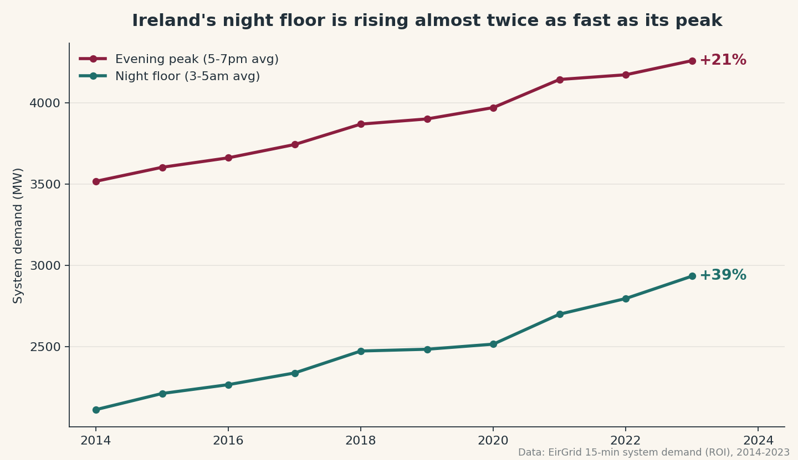
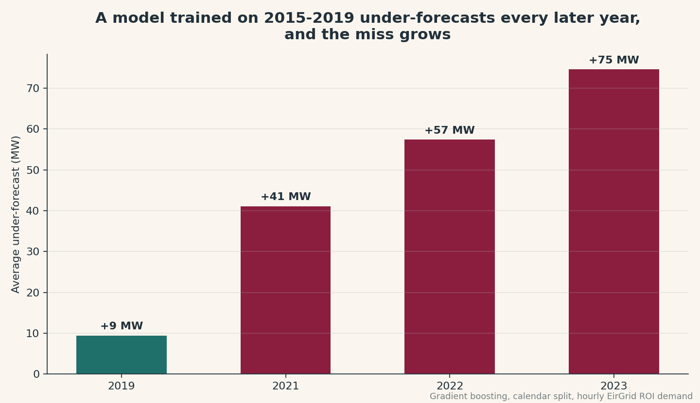

# The Data Centre Fingerprint in Ireland's Grid

I analysed 11 years of Ireland's electricity demand. The growth isn't happening when you'd expect.



## The finding

Ireland records national electricity demand every 15 minutes. I took 11 years of it, 2014 to 2023, around 355,000 readings, and asked one question: *when* in the day is demand growing?

The answer is 4am.

Demand in the dead of night, when the country is asleep, grew 39% over the period. The evening peak, when everyone is home cooking and watching TV, grew only 21%. The night floor climbed from 60% of the peak to 69%. Ireland's quiet hours are disappearing.

Humans sleep. Machines don't. Round-the-clock growth is the fingerprint of always-on load, and Ireland has more of it than anywhere on earth: data centres now consume roughly 21% of the country's electricity (SEAI, Energy in Ireland 2024).

## Why it matters

Grid forecasting models learn from history. I trained a standard gradient boosting model on 2015–2019 data only, then tested it on the years it had never seen.



In 2019 the model is nearly perfect: 50 MW average error, no systematic lean. By 2023 it under-forecasts by 75 MW *on average, every hour, always in the same direction*. A persistent one-directional bias is the statistical signature of a structural break. The model isn't noisy. It is faithfully predicting a country that no longer exists.

Any forecasting system trained on pre-2020 Ireland inherits this problem. Since electricity can't be stored at scale, forecast misses translate directly into expensive balancing actions.

## Robustness checks

- **"Offices contaminate your night floor."** Recomputed using weekends only: same 39% growth.
- **"It's a fluke."** The floor's share of peak rises +0.83 percentage points per year, r² = 0.90, p = 2.5e-05.
- **"Curve shapes don't prove cause."** True. But SEAI's metered data independently attributes 88.2% of Irish demand growth since 2015 to data centres. Two completely different methods, one from meters, one from the shape of the demand curve, reach the same conclusion.

## Honest limitations

- The dataset is raw 15-minute SCADA data published by EirGrid; EirGrid notes it is unvalidated.
- This snapshot ends December 2023. SEAI reports 2024 demand grew a further 4.1%, so the trend continues.
- Electric vehicles and heat pumps also lift night-time demand. They are real contributors, but cannot explain the magnitude: night-floor growth accounts for essentially all average demand growth since 2015, consistent with the official data-centre attribution.

## Reproduce it

```
pip install -r requirements.txt
python analysis.py      # all findings printed
python make_charts.py   # regenerates the charts
```

Demand CSVs in `data/` were obtained via [Daniel-Parke/EirGrid_Data_Download](https://github.com/Daniel-Parke/EirGrid_Data_Download), original source EirGrid Smart Grid Dashboard.

## Author

Neelam Jat — MSc International Business (UCD), data analyst.
GitHub: [Neelam-jat](https://github.com/Neelam-jat)
